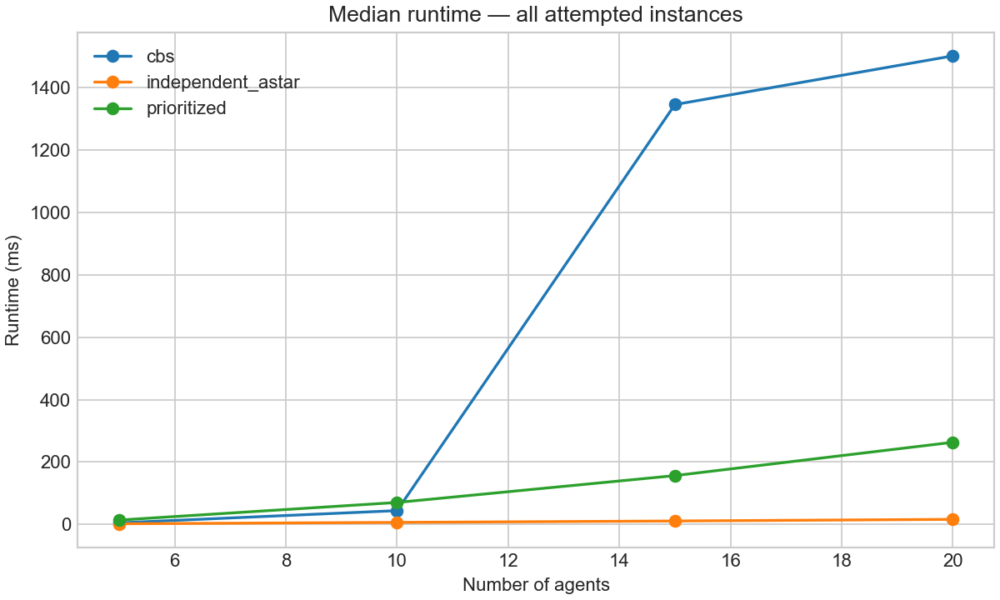
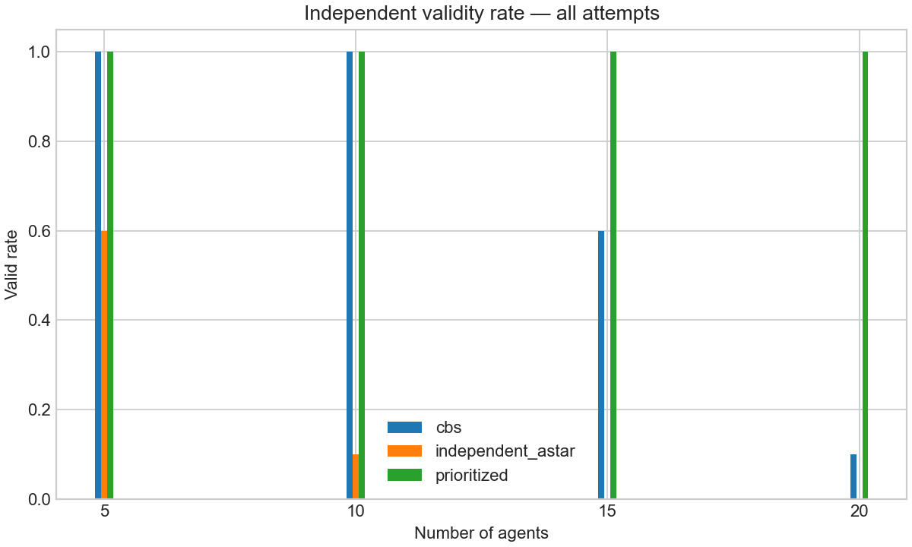
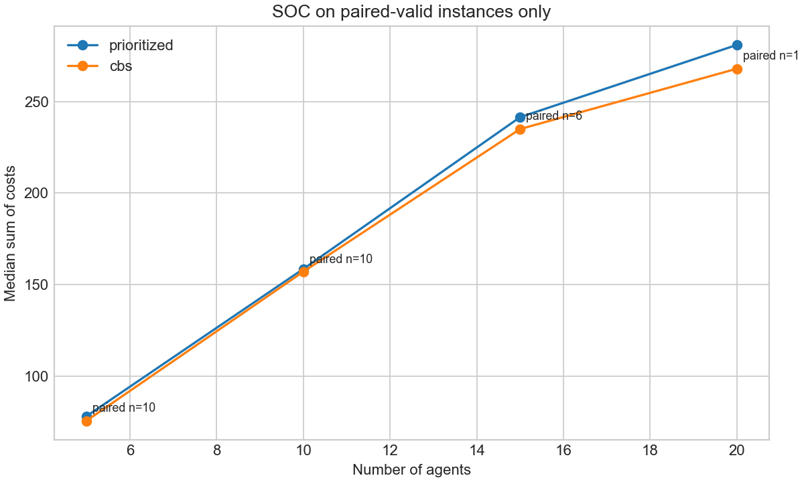

# Warehouse-MAPF-Bench v0.2

**自动化仓储多智能体路径规划的可复现配对基准 / A reproducible paired benchmark for warehouse Multi-Agent Path Finding**

[中文](#中文说明) · [English](#english)

本项目在 Python 中自主实现 A*、Space-Time A*、Prioritized Planning 和 Conflict-Based Search（CBS），并使用独立验证器、明确的结果分类、配对有效实例统计，以及合成仓储和官方 Moving AI 仓储数据进行可复现实验。

This project implements A*, Space-Time A*, Prioritized Planning, and Conflict-Based Search (CBS) locally in Python, with independent validation, explicit outcome categories, paired-valid quality analysis, and reproducible synthetic plus official Moving AI warehouse experiments.


动画来自 8 台 AGV 的真实、已验证 Prioritized Planning 解，而非预设轨迹。
The animation is rendered from a real, independently validated 8-agent Prioritized Planning solution.

---

## 中文说明

### 为什么需要 MAPF？

为每台 AGV 独立计算最短路径会产生两类同步冲突：两台 AGV 同时占据一个栅格的**顶点冲突**，以及同时交换相邻栅格的**边交换冲突**。MAPF 在空间和离散时间上联合规划，并将 AGV 到达后的目标点视为持续占用。

### 算法与正确性边界

| 算法 | 冲突感知 | 用途与限制 |
| --- | --- | --- |
| Independent A* | 否 | 不可行基线；保留并报告冲突 |
| Prioritized Planning | 是 | 快速但不完备，依赖智能体顺序 |
| CBS | 是 | 标准约束树搜索；超时、扩展上限和有限 horizon 会限制求解结论 |

CBS 将一个绝对 deadline 传递到高层和底层搜索。只有完整返回全部路径才算 `success`；随后还必须通过独立验证才能算 `valid`。超时或 cutoff 的运行不声称全局最优。

### 运行结果语义

- `outcome`：`solved`、`timeout`、`no_solution`、`no_solution_within_limits` 或 `error`；
- `success`：在限制前返回了全部智能体的完整路径；
- `valid`：`success=True` 且独立验证通过起终点、障碍物、合法移动、顶点冲突、边交换和目标点持续占用；
- `timed_out`：仅在 `outcome=timeout` 时为真；
- `runtime_ms`：每一次尝试的墙钟时间，失败和超时同样保留；
- `instance_id`：包含地图、智能体规模、seed/selection，以及 Moving AI 精确场景行号的稳定标识。

受约束搜索未在有限 horizon/扩展限制内找到路径时，保守标记为 `no_solution_within_limits`，不宣称数学意义上的不可解。

### 配对质量比较

CBS 与 Prioritized Planning 的 SOC/makespan 只在**相同 instance_id 且两者都 valid**的交集上比较：

```text
SOC delta = SOC(Prioritized) - SOC(CBS)
```

正值表示 CBS 的 SOC 更低。所有表和图都同时显示 `paired_valid_instances`；没有共同有效实例时质量指标为 `N/A`，不是 0。

### 安装、测试与实验命令

```bash
python -m pip install -e ".[dev]"
pytest -q
python -m warehouse_mapf.demo

# 快速 smoke：5/10/15 agents × 5 seeds，CBS 0.6 s
python -m warehouse_mapf.benchmark --quick

# 较大合成实验：5/10/15/20 agents × 10 seeds，CBS 1.5 s
python -m warehouse_mapf.benchmark --larger

# 官方 Moving AI 仓储子集
python -m warehouse_mapf.standard_benchmark \
  --map data/movingai/warehouse-10-20-10-2-1.map \
  --scen data/movingai/warehouse-10-20-10-2-1-even-1.scen \
  --agents 5 10 --selection-seeds 0 1 2 --cbs-timeout 0.6
```

### 较大合成实验结果

配置：18 × 28 确定性合成仓储地图，5/10/15/20 台 AGV，每个规模 seeds 0–9，共 120 次算法尝试。运行级数据、汇总和配对明细位于 [`benchmarks/synthetic_larger/`](benchmarks/synthetic_larger/)。

合成 larger 实验与官方 Moving AI 子集还被合并为 [`benchmarks/v0_2_study/`](benchmarks/v0_2_study/) 中的 138 次完整研究记录；该目录的 manifest 指向两个原始结果文件，所有派生表均可重新计算。

全部尝试的 success/valid/timeout：

| AGV 数 | Independent success/valid | Prioritized success/valid | CBS success/valid/timeout |
| ---: | ---: | ---: | ---: |
| 5 | 10/6 | 10/10 | 10/10/0 |
| 10 | 10/1 | 10/10 | 10/10/0 |
| 15 | 10/0 | 10/10 | 6/6/4 |
| 20 | 10/0 | 10/10 | 1/1/9 |

仅共同有效实例的质量比较：

| AGV 数 | 配对有效 n | 配对 SOC：Prioritized | 配对 SOC：CBS | 中位逐实例 ΔSOC |
| ---: | ---: | ---: | ---: | ---: |
| 5 | 10 | 78.0 | 75.5 | 0.0 |
| 10 | 10 | 158.5 | 157.0 | 0.0 |
| 15 | 6 | 241.5 | 235.0 | +7.5 |
| 20 | 1 | 281.0 | 268.0 | +13.0 |







谨慎结论：在这组数据上，Prioritized Planning 的 40 个运行全部有效；CBS 随规模增大出现大量超时。15 台 AGV 的 `+7.5` 来自 6 个共同有效实例，20 台的 `+13` 仅来自 1 个实例，不能推广到全部实例，更不能据此宣称工业性能或超时运行的最优性。

### 官方 Moving AI 仓储数据

项目实际运行了官方 `warehouse-10-20-10-2-1.map`（161 × 63）和 `warehouse-10-20-10-2-1-even-1.scen`。每个规模用 selection seeds 0、1、2 确定性选择不重复起点/终点，精确行号记录在 [`selection_manifest.json`](benchmarks/movingai/selection_manifest.json)。

| AGV 数 | 每算法尝试 | Prioritized 有效 | CBS 有效 | 配对有效 n | 配对中位 SOC（两者） | 中位 ΔSOC |
| ---: | ---: | ---: | ---: | ---: | ---: | ---: |
| 5 | 3 | 3 | 3 | 3 | 533.0 | 0.0 |
| 10 | 3 | 3 | 3 | 3 | 976.0 | 0.0 |

数据来源、官方 URL、获取日期、许可证说明和选择规则见 [`data/movingai/README.md`](data/movingai/README.md)。Moving AI 页面声明数据采用 Open Data Commons Attribution License。该小规模结果只证明解析、选择、验证和报告流程可复现。

### 测试与 CI

测试覆盖：A*、冲突检测、目标点持续占用、Space-Time A* 约束、已知最优 SOC、三智能体级联冲突、不可能实例、确定性 CBS 超时、报告选择偏差回归、Moving AI 格式/坐标/异常数据，以及确定性场景选择。GitHub Actions 在 Python 3.11 和 3.12 上从 `pyproject.toml` 的 `[dev]` extra 安装并运行 `pytest -q`。

### 局限性

- 离散栅格不建模加速度、转弯半径和连续空间避碰；
- 只研究路径规划，不包含任务分配、调度、充电或仓库控制；
- Prioritized Planning 不完备且依赖顺序；
- CBS 使用有限 horizon、deadline 和扩展上限，大规模失败不等于不可解；
- 实验规模用于方法学和复现，不代表工业仓库吞吐性能。

---

## English

### Why MAPF?

Independent shortest paths can cause a **vertex conflict** when two AGVs occupy one cell simultaneously, or an **edge-swap conflict** when they exchange adjacent cells. MAPF plans jointly in space and discrete time, including held-goal occupancy after arrival.

### Algorithms and correctness boundary

| Algorithm | Conflict aware | Role and limitation |
| --- | --- | --- |
| Independent A* | No | Infeasible baseline; conflicts remain visible |
| Prioritized Planning | Yes | Fast, incomplete, and order-dependent |
| CBS | Yes | Standard constraint-tree search bounded by deadline, expansion limit, and finite horizon |

CBS shares one absolute deadline across high- and low-level searches. `success` requires a complete returned path set; `valid` additionally requires independent validation. Timed-out or cutoff runs carry no global-optimality claim.

### Outcome semantics

- `outcome`: `solved`, `timeout`, `no_solution`, `no_solution_within_limits`, or `error`;
- `success`: all agent paths returned before the configured limit;
- `valid`: successful output that passes endpoints, obstacles, legal moves, vertex conflicts, edge swaps, and goal-holding checks;
- `timed_out`: true exactly for a time-limit exit;
- `runtime_ms`: wall-clock duration for every attempt, including failures;
- `instance_id`: stable map/scale/seed-or-selection identity, including exact Moving AI row IDs.

Finite-horizon or cutoff exhaustion is conservatively reported as `no_solution_within_limits`, not as a proof of impossibility.

### Paired quality methodology

CBS and Prioritized Planning SOC/makespan are compared only on identical instance IDs where **both outputs validate**. The per-instance convention is `SOC(Prioritized) - SOC(CBS)`, so a positive delta favors CBS. Every quality result includes its paired sample count; an empty intersection is `N/A`.

### Commands

```bash
python -m pip install -e ".[dev]"
pytest -q
python -m warehouse_mapf.demo
python -m warehouse_mapf.benchmark --quick
python -m warehouse_mapf.benchmark --larger
python -m warehouse_mapf.standard_benchmark \
  --map data/movingai/warehouse-10-20-10-2-1.map \
  --scen data/movingai/warehouse-10-20-10-2-1-even-1.scen \
  --agents 5 10 --selection-seeds 0 1 2 --cbs-timeout 0.6
```

### Recorded findings

The larger synthetic experiment contains 120 attempts over 5/10/15/20 agents and seeds 0–9. Prioritized Planning validated on all 40 instances. CBS validated on 10/10, 10/10, 6/10, and 1/10 instances respectively, with 4 timeouts at 15 agents and 9 at 20 agents. Paired-valid sample counts are therefore 10, 10, 6, and 1—not the full denominator at the larger scales. Median per-instance SOC deltas are 0, 0, +7.5, and +13; the last value is based on one instance and is not a general quality claim.

The official Moving AI run uses the 161 × 63 `warehouse-10-20-10-2-1` map and one complete official even scenario file. Three deterministic selections at each of 5 and 10 agents produced 3 paired-valid instances per scale; median SOC was equal between CBS and Prioritized Planning on both small subsets. Exact selected rows and provenance are committed.

### Repository layout

```text
src/warehouse_mapf/          algorithms, parsers, validation, reporting, CLIs
tests/                       correctness, parser, timeout, and reporting tests
data/movingai/               official map/scenario subset and provenance
benchmarks/smoke/            smoke raw and derived results
benchmarks/synthetic_larger/ larger raw and paired results
benchmarks/movingai/         official-data results and selection manifest
benchmarks/v0_2_study/       combined 138-attempt v0.2 study tables
assets/                      GIF and outcome/paired-quality plots
```

### Limitations

- The discrete grid omits acceleration, turning radius, and continuous collision avoidance.
- This is routing only, without assignment, scheduling, charging, or warehouse control.
- Prioritized Planning is incomplete and order-dependent.
- CBS uses finite horizons and resource limits; failure at scale is not a proof of unsolvability.
- These experiments demonstrate reproducibility and methodology, not industrial throughput.

## References / 参考资料

- Stern et al., *Multi-Agent Pathfinding: Definitions, Variants, and Benchmarks*, SoCS 2019. [Moving AI MAPF Benchmarks](https://www.movingai.com/benchmarks/mapf/)
- Sharon et al., *Conflict-Based Search for Optimal Multi-Agent Pathfinding*, Artificial Intelligence 219, 2015.
