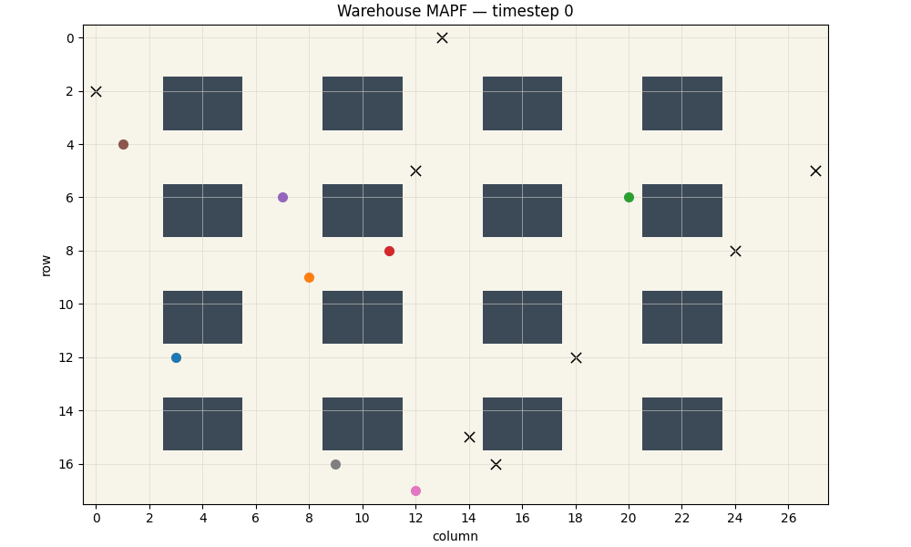
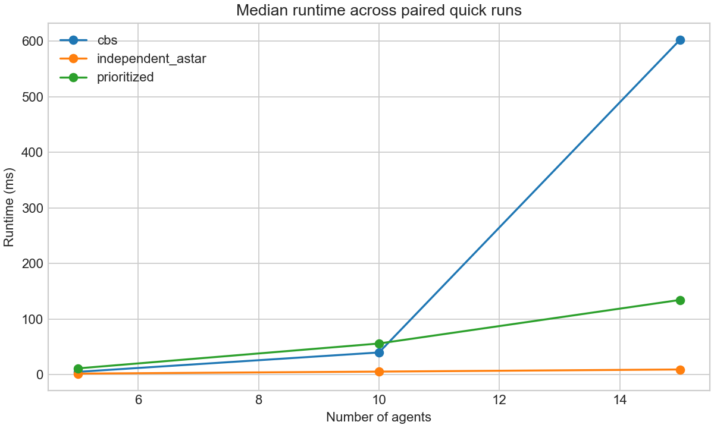
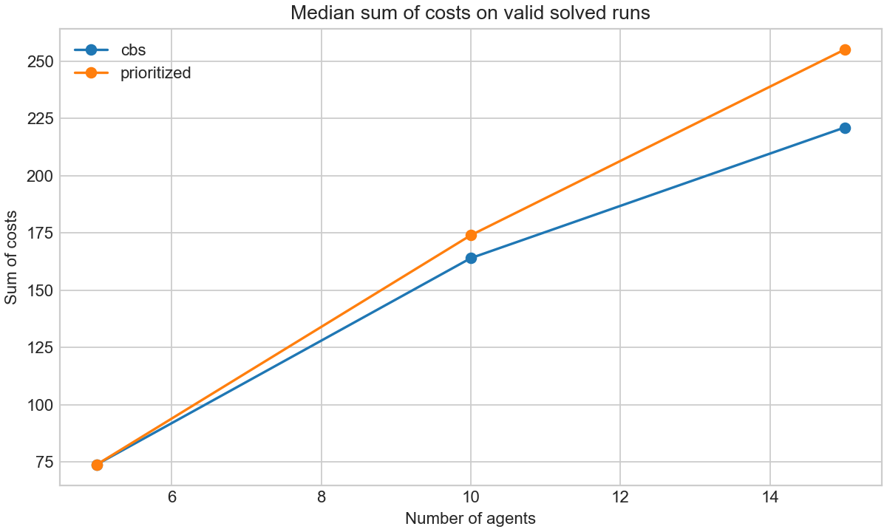

# Warehouse-MAPF-Bench

**自动化仓储多智能体路径规划算法基准 / Benchmarking Multi-Agent Path Finding Algorithms in Automated Warehouses**

[中文](#中文说明) · [English](#english)

一个紧凑、可复现的 Python 算法工程项目，实现并比较 A*、优先级规划和冲突搜索，用于自动化仓储栅格中的多 AGV 无碰撞路径规划。

A compact, reproducible Python implementation and benchmark of A*, Prioritized Planning, and Conflict-Based Search for collision-free multi-AGV routing on warehouse grids.



动画由优先级规划算法的真实输出生成：8 台 AGV、18 × 28 确定性合成仓储地图、随机种子 17，所有轨迹均通过独立验证。

The animation is generated from validated Prioritized Planning paths for 8 AGVs on a deterministic 18 × 28 synthetic warehouse map with seed 17.

---

## 中文说明

### 为什么需要 MAPF？

为每台 AGV 独立计算最短路径并不足够，因为同步运动时可能出现：

- **顶点冲突**：两台 AGV 在同一时刻占据同一栅格；
- **边交换冲突**：两台 AGV 在同一时刻交换相邻栅格。

多智能体路径规划（MAPF）同时在空间和离散时间上规划，从而显式避免这些冲突。

### 已实现算法

| 算法 | 感知多智能体冲突 | 说明 | 定位 |
| --- | --- | --- | --- |
| Independent A* | 否 | 为每台 AGV 独立计算静态最短路径，保留产生的冲突 | 朴素基线 |
| Prioritized Planning | 是 | 按顺序规划并预留已有轨迹；不完备且依赖优先级 | 快速启发式方法 |
| Conflict-Based Search（CBS） | 是 | 标准约束树分裂，底层使用 Space-Time A* | 小规模精确式基线 |

Space-Time A* 搜索状态为 `(行, 列, 时间)`，支持 `WAIT`、顶点约束和有向边约束，并使用有限时间范围避免无限扩展等待状态。

```text
场景 Scenario
   ├── Independent A*
   ├── Prioritized Planning ── Space-Time A*
   └── CBS ─────────────────── Space-Time A*
             │
             ▼
          独立验证
             │
             ▼
      指标 / CSV / 图表 / GIF
```

### 快速开始

```bash
python -m pip install -r requirements.txt
pytest -q
python -m warehouse_mapf.demo
python -m warehouse_mapf.benchmark --quick
```

### 基准实验方法

仓库中已提交的 quick benchmark 使用 5、10、15 台 AGV，每个规模运行 5 个随机种子（0–4），共得到 45 条真实测量记录。对于每一个 `(AGV 数量, seed)` 组合，三个算法接收完全相同的地图、起点和终点。CBS 每个实例的超时限制为 0.6 秒，失败和超时记录均保留在 CSV 中。

`success` 表示求解器返回了所有 AGV 的路径；`valid` 还要求独立验证器确认起终点、移动合法性、障碍物规避，以及不存在顶点冲突和边交换冲突。运行时间对全部运行聚合，路径质量只对成功且有效的解聚合。

| 算法 | AGV 数 | 运行数 | 成功率 | 有效率 | 中位运行时间（ms） | 有效解中位成本 | 平均冲突数 |
| --- | ---: | ---: | ---: | ---: | ---: | ---: | ---: |
| CBS | 5 | 5 | 1.0 | 1.0 | 5.262 | 74.0 | 0.0 |
| CBS | 10 | 5 | 1.0 | 1.0 | 40.098 | 164.0 | 0.0 |
| CBS | 15 | 5 | 0.4 | 0.4 | 602.282 | 221.0 | 0.0 |
| Independent A* | 5 | 5 | 1.0 | 0.6 | 2.069 | 69.0 | 0.4 |
| Independent A* | 10 | 5 | 1.0 | 0.2 | 5.685 | 143.0 | 2.8 |
| Independent A* | 15 | 5 | 1.0 | 0.0 | 9.493 | — | 6.4 |
| Prioritized Planning | 5 | 5 | 1.0 | 1.0 | 11.479 | 74.0 | 0.0 |
| Prioritized Planning | 10 | 5 | 1.0 | 1.0 | 56.218 | 174.0 | 0.0 |
| Prioritized Planning | 15 | 5 | 1.0 | 1.0 | 134.573 | 255.0 | 0.0 |

原始数据位于 [`benchmarks/results.csv`](benchmarks/results.csv)，聚合结果位于 [`benchmarks/summary.csv`](benchmarks/summary.csv)。15 台 AGV 的 CBS 实验中有 3 次超时，这些记录被完整保留。





在本次 quick benchmark 中，Prioritized Planning 在全部 15 个配对实例上均返回有效解。CBS 在 10 台 AGV 时获得了比 Prioritized Planning 更低的中位路径成本（164 对 174），但在 15 台 AGV 时仅有 2/5 的实例在限制时间内求解成功。Independent A* 速度最快，但随着 AGV 数量增加更容易产生冲突，因此没有纳入可行多智能体解的成本图。

### 正确性保障

测试覆盖静态 A* 最短路径、障碍物和不可达目标、顶点冲突、边交换冲突、目标点持续占用、Space-Time A* 约束等待与未来目标约束、Prioritized Planning、CBS、独立解验证和确定性场景生成。benchmark 结果只有在通过独立验证后才会被标记为有效。

### 仓库结构

```text
src/warehouse_mapf/   算法、验证器、场景、命令行与可视化
tests/                正确性与集成测试
benchmarks/           逐次运行与聚合 CSV
assets/               GIF 动画与实验图表
docs/                 算法和实验说明
```

### 局限性

- 离散栅格模型不包含加速度、转弯半径和连续空间避碰；
- 项目只处理路径规划，不包含任务分配、调度、充电和仓库控制；
- Prioritized Planning 不完备，结果依赖智能体顺序；
- CBS 在困难或大规模实例上的运行时间扩展较差；
- 当前场景是确定性合成仓储地图，并非真实运营数据。

---

## English

### Why MAPF?

Independent shortest paths are insufficient because synchronous AGV movement can produce:

- a **vertex conflict**, where two AGVs occupy one cell at the same timestep;
- an **edge-swap conflict**, where two AGVs exchange adjacent cells simultaneously.

Multi-Agent Path Finding plans in both space and discrete time to avoid these conflicts explicitly.

### Implemented algorithms

| Algorithm | Conflict aware | Notes | Role |
| --- | --- | --- | --- |
| Independent A* | No | Static shortest paths per AGV; conflicts are retained | Naive baseline |
| Prioritized Planning | Yes | Sequential reservations; incomplete and order-dependent | Fast heuristic |
| Conflict-Based Search (CBS) | Yes | Standard constraint-tree branching with Space-Time A* | Small-instance exact-style baseline |

Space-Time A* searches `(row, column, time)`, supports `WAIT`, vertex constraints, and directed edge constraints, and uses a finite horizon to bound wait-state expansion.

### Quick start

```bash
python -m pip install -r requirements.txt
pytest -q
python -m warehouse_mapf.demo
python -m warehouse_mapf.benchmark --quick
```

### Benchmark methodology

The checked-in quick benchmark uses 5, 10, and 15 agents with five seeds (0–4), producing 45 measured runs. All three algorithms receive the same map, starts, and goals for each `(agent count, seed)` pair. CBS has a 0.6-second per-instance timeout; failures and timeouts remain in the CSV.

`success` means that the solver returned every path. `valid` additionally requires the independent validator to confirm endpoints, legal motion, obstacle avoidance, and zero vertex or edge-swap conflicts. Runtime is aggregated over all runs, while path quality uses successful and valid solutions only.

| Algorithm | Agents | Runs | Success | Valid | Median runtime (ms) | Median valid cost | Mean conflicts |
| --- | ---: | ---: | ---: | ---: | ---: | ---: | ---: |
| CBS | 5 | 5 | 1.0 | 1.0 | 5.262 | 74.0 | 0.0 |
| CBS | 10 | 5 | 1.0 | 1.0 | 40.098 | 164.0 | 0.0 |
| CBS | 15 | 5 | 0.4 | 0.4 | 602.282 | 221.0 | 0.0 |
| Independent A* | 5 | 5 | 1.0 | 0.6 | 2.069 | 69.0 | 0.4 |
| Independent A* | 10 | 5 | 1.0 | 0.2 | 5.685 | 143.0 | 2.8 |
| Independent A* | 15 | 5 | 1.0 | 0.0 | 9.493 | — | 6.4 |
| Prioritized Planning | 5 | 5 | 1.0 | 1.0 | 11.479 | 74.0 | 0.0 |
| Prioritized Planning | 10 | 5 | 1.0 | 1.0 | 56.218 | 174.0 | 0.0 |
| Prioritized Planning | 15 | 5 | 1.0 | 1.0 | 134.573 | 255.0 | 0.0 |

Run-level data are available in [`benchmarks/results.csv`](benchmarks/results.csv), with aggregates in [`benchmarks/summary.csv`](benchmarks/summary.csv). Three 15-agent CBS runs timed out and remain in the reported data and rates.

On this quick benchmark, Prioritized Planning returned valid solutions for all 15 paired instances. CBS achieved a lower median path cost than Prioritized Planning at 10 agents (164 versus 174), but solved only 2 of 5 instances at 15 agents within the configured limit. Independent A* is fastest but increasingly conflict-prone, so it is excluded from the feasible multi-agent cost chart.

### Correctness

The test suite covers static A* shortest paths, obstacles, unreachable goals, vertex conflicts, edge swaps, goal holding, constrained waits, future goal constraints, Prioritized Planning, CBS, independent validation, and deterministic scenario generation. Benchmark results are marked valid only after independent validation.

### Repository layout

```text
src/warehouse_mapf/   algorithms, validation, scenarios, CLI, visualization
tests/                correctness and integration tests
benchmarks/           run-level and aggregate CSVs
assets/               generated GIF and benchmark plots
docs/                 algorithm and experiment notes
```

### Limitations

- The discrete grid model does not represent acceleration, turning radius, or continuous collision avoidance.
- The project addresses routing, not task assignment, scheduling, charging, or warehouse control.
- Prioritized Planning is incomplete and depends on agent ordering.
- CBS runtime scales poorly on difficult or larger instances.
- The scenarios are deterministic synthetic warehouse layouts, not operational telemetry.

## References / 参考资料

- Stern et al., *Multi-Agent Pathfinding: Definitions, Variants, and Benchmarks*, SoCS 2019. [Moving AI MAPF benchmarks](https://www.movingai.com/benchmarks/mapf.html)
- Sharon et al., *Conflict-Based Search for Optimal Multi-Agent Pathfinding*, Artificial Intelligence 219, 2015.

## Resume summary / 简历描述

实现了面向仓储 MAPF 的 A*、Space-Time A*、Prioritized Planning 和 Conflict-Based Search；构建了独立碰撞验证器，并在三个 AGV 规模、五个随机种子的配对场景上完成可复现实验，评估运行时间、成功率、有效率、makespan、路径成本和冲突数，同时生成多 AGV 动画。

Implemented A*, Space-Time A*, Prioritized Planning, and Conflict-Based Search for warehouse MAPF; built an independent collision validator and a reproducible paired benchmark across three agent scales and five seeds; evaluated runtime, success, validity, makespan, sum-of-costs, and conflicts while producing an animated multi-AGV visualization.
